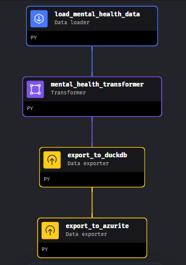
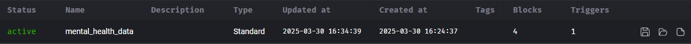
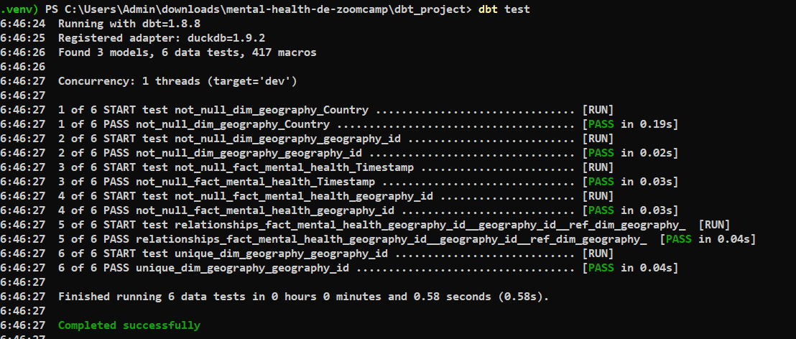
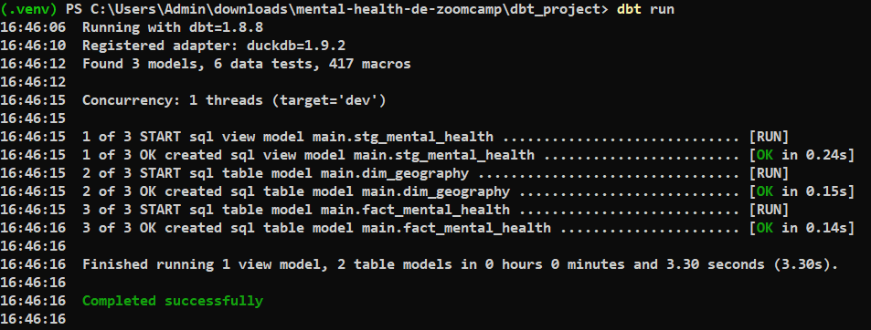
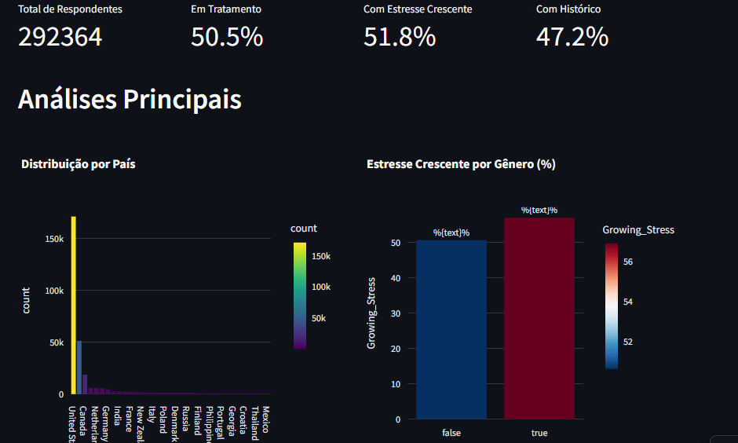

# Data Engineering Project

## 🧠📊 Mental Health


This project demonstrates an end-to-end data pipeline built using modern tools and best practices in data engineering. The pipeline extracts, transforms, loads, and visualizes data from a global mental health survey, applying concepts learned in the Data Engineering Zoomcamp.
 
---

## Table of Contents

- [Overview](#overview)
- [Problem Statement](#problem-statement)
- [Project Objectives](#project-objectives)
- [How to Clone This Project](how-to-clone-this-project)
- [About the Dataset](#about-the-dataset)
- [Pipeline Architecture](#pipeline-architecture)
- [Technologies and Tools Used](#technologies-and-tools-used)
- [Languages Used](languages-used)
- [Project Structure Basic](#project-structure-basic)
- [Setup and Execution Guide](#setup-and-execution-guide)
  - [1. Environment Setup](#1-environment-setup)
  - [2. Infrastructure Provisioning (Terraform)](#2-infrastructure-provisioning-terraform)
  - [3. Data Ingestion Pipeline (Mage)](#3-data-ingestion-pipeline-mage)
  - [4. Data Transformation (DBT)](#4-data-transformation-dbt)
  - [5. Interactive Dashboard (Streamlit)](#5-interactive-dashboard-streamlit)
  - [6. Pipeline Execution Screenshots](#6-pipeline-execution-screenshots)
- [Conclusion](#conclusion)
- [Final Considerations](#final-considerations)
- [References](#references)

---

## Overview

This project focuses on building a robust and modular end-to-end data pipeline that ingests, transforms, and visualizes mental health survey data. The approach supports batch processing and integrates multiple technologies to ensure scalability, reproducibility, and ease of maintenance.

---

## Problem Statement

Mental health is a critical global issue. This project utilizes a dataset that records a global survey on mental health, covering aspects such as stress levels, depression, anxiety, subjective well-being, and the use of mental health services. Analyzing this data helps identify relevant trends and patterns, supporting a better understanding of changes in mental health across different demographics and over time.

---

## Project Objectives

- **Data Extraction and Ingestion:**  
  Select a mental health dataset and ingest the data into a local data lake using Azurite.
- **Data Storage and Loading:**  
  Move the ingested data to a local data warehouse using DuckDB.
- **Data Transformation:**  
  Use DBT to clean, transform, and prepare the data for analysis.
- **Visualization:**  
  Build an interactive dashboard using Streamlit that includes at least two tiles:  
  - A chart showing the distribution of categorical data (e.g., by country or gender).  
  - A chart illustrating the evolution of data over time or another temporal dimension.
- **Workflow Orchestration and Automation:**  
  Organize the complete flow using modern tools, ensuring a scalable and maintainable solution.

---

## How to Clone This Project

To get started with this project locally, follow the steps below:

### 1. Clone the repository

```bash
git clone https://github.com/nathadriele/data-engineering-zoomcamp.git
```

### 2. Navigate to the project folder

```bash
cd data-engineering-zoomcamp/project-2025
```

### 3. Explore the structure

Inside the project-2025 directory, you’ll find all the components needed for the end-to-end pipeline, including:

- `infrastructure/ — Infrastructure as Code using Terraform and Docker`.
- `data_pipeline/ — Data ingestion logic and Mage project`.
- `dbt_project/ — DBT models for data transformation`.
- `visualization/ — Streamlit dashboard and Plotly visualizations`.
- `README.md — Documentation with setup and execution guide`.

---

## About the Dataset


The dataset used in this project is obtained from [Kaggle](https://www.kaggle.com/datasets/divaniazzahra/mental-health-dataset) and contains the results of a global mental health survey.

**Dataset Details:**

- **Context:** A global survey conducted to track trends in mental health.
- **Variables Included:**
  - `Timestamp`: Date and time of the record.
  - `Gender`: Respondent's gender.
  - `Country`: Country of origin.
  - `Occupation`: Professional occupation.
  - `Self_employed`: Indicator whether the respondent is self-employed.
  - `Family_history`: Family history of mental health issues.
  - `Treatment`: Indicator if the respondent is seeking treatment.
  - `Days_Indoors`: Number of days the respondent stayed indoors.
  - `Growing_Stress`: Indicator of increasing stress.
  - `Changes_Habits`: Changes in respondent's habits.
  - `Mental_Health_History`: History of mental health issues.
  - `Mood_Swings`: Mood swings.
  - `Coping_Struggles`: Difficulty coping with situations.
  - `Work_Interest`: Interest in work.
  - `Social_Weakness`: Weakness in social interactions.
  - `Mental_Health_Interview`: Attitude during mental health interviews.
  - `Care_options`: Awareness of available care options.
- **Goal:** Provide insights into global changes in mental health over the survey period.

---

## Pipeline Architecture


The pipeline consists of five main stages:

1. **Infrastructure:**  
   Provision a local environment using Terraform to configure Azurite (Azure Storage emulator) and DuckDB (data warehouse).

2. **Data Ingestion:**  
   A pipeline created with Mage extracts data from the dataset and uploads it to the data lake (Azurite).

3. **Data Loading:**  
   Transfer data from Azurite to the data warehouse (DuckDB).

4. **Data Transformation:**  
   Use DBT to transform and validate the data, preparing it for visualization.

5. **Visualization:**  
   Build an interactive dashboard using Streamlit to display data insights with dynamic charts.

---

## Technologies and Tools Used


In this project, a suite of modern and specialized tools was integrated to build a robust end-to-end data pipeline. Each tool plays a critical role in the process of extracting, transforming, loading, and visualizing data. Below is a detailed description of each tool and its purpose within the project:

### Terraform
   - `Description`: A powerful Infrastructure as Code (IaC) tool that enables the declarative creation, modification, and versioning of infrastructure.
   - `Role in the Project`: Used to provision and configure the local environment, including the Azure Storage emulator (Azurite) and other infrastructure dependencies. This ensures that the environment is reproducible, scalable, and version-controlled.

### Docker
   - `Description`: A platform for developing, shipping, and running applications in isolated containers. It provides a lightweight and consistent runtime environment across systems.
   - `Role in the Project`: Used to run Azurite locally in a containerized environment. This allows the simulation of Azure Blob Storage services without needing access to the cloud, enabling consistent and reproducible development and testing.

### Mage
   - `Description`: A modern platform for designing and orchestrating data pipelines, making it easier to construct and execute data ingestion flows.
   - `Role in the Project`: Manages the data ingestion pipeline by extracting data from the source dataset and uploading it to the data lake (Azurite). It ensures smooth and automated data flow from extraction to storage.

### Azurite
   - `Description`: A local emulator for Azure Storage that simulates the behavior of Azure’s storage services without requiring a cloud environment.
   - `Role in the Project`: Serves as the local data lake where raw data is initially stored after ingestion. This setup allows for testing and development in a cost-effective and controlled environment.

### DuckDB
   - `Description`: A high-performance, columnar-oriented relational database optimized for analytical queries. It is designed for efficient local data processing and analysis.
   - `Role in the Project`: Acts as the data warehouse by storing and enabling efficient querying of the ingested data from Azurite. This facilitates further transformation and analysis steps.

### DBT (Data Build Tool)
   - `Description`: A transformation tool that enables data modeling, testing, and documentation using SQL. It enforces best practices in data transformation and quality assurance.
   - `Role in the Project`: Responsible for transforming and modeling the data stored in DuckDB. DBT applies rigorous testing and validation, ensuring that the data is clean and ready for analysis before it is visualized.

### Streamlit
   - `Description`: An open-source Python framework that simplifies the creation of interactive web applications, particularly dashboards and data visualizations.
   - `Role in the Project`: Used to build an interactive dashboard that dynamically displays insights from the mental health data. Streamlit offers a user-friendly interface for exploring and interacting with the visualized data.

### Plotly
   - `Description`: A versatile data visualization library in Python that provides interactive, high-quality charts and graphs.
   - `Role in the Project`: Integrated with Streamlit to generate dynamic and interactive visualizations. Plotly enhances the dashboard by enabling detailed exploration of data trends and distributions.

---

## 💻 Languages Used


| Language       | Purpose                                                                                              |
|----------------|------------------------------------------------------------------------------------------------------|
| **Python**     | Used for building data ingestion pipelines (with Mage), helper scripts, and interactive dashboards using Streamlit and Plotly. |
| **SQL**        | Employed in data transformation and modeling within DBT, as well as analytical queries in DuckDB.     |
| **HCL**        | Utilized for defining infrastructure as code with Terraform, enabling automated and reproducible setups. |
| **YAML**       | Handles configuration of Mage pipelines, DBT models, and environment parameters.                     |
| **PowerShell** | Powers local automation tasks, including service orchestration and Azurite setup on Windows.         |
| **Markdown**   | Documents the project structure, setup instructions, and technical references in the README and other files. |

---

## Project Structure Basic

```powershell
mental_health_project/
│
├── data/
│   ├── duckdb/
│   │   ├── logs/                     # DuckDB logs (debug, query logs, etc.)
│   │   └── mental_health.db          # Local DuckDB database file
│   ├── mental_health_dataset.csv     # Original mental health dataset
│   └── ...                           # Other data sources, if any
│
├── dbt_project/
│   ├── dbt_packages/                 # Installed DBT packages
│   ├── logs/                         # DBT execution logs
│   ├── models/
│   │   ├── marts/
│   │   │   ├── dim_geography.sql     # Example: Geography dimension table
│   │   │   ├── fact_mental_health.sql# Example: Mental health fact table
│   │   │   └── schema.yml            # Model definitions and tests for marts
│   │   └── staging/
│   │       └── stg_mental_health.sql # Staging model for raw mental health data
│   ├── target/                       # Compiled artifacts and DBT run results
│   │   └── ...                       
│   ├── dbt_project.yml               # Main DBT project configuration file
│   └── profiles.yml                  # Connection configuration (e.g., DuckDB)
│
├── images/                           # Illustrative images and project screenshots
│   ├── Mage Pipeline Structure.png
│   ├── Mage Pipeline Metadata.png
│   ├── DBT Test Output.png
│   ├── DBT Run Output.png
│   └── Streamlit Dashboard.png
│
├── mage_project/
│   ├── data_exporters/               # Scripts to export data (e.g., to DuckDB)
│   │   ├── export_to_duckdb.py
│   │   └── load_mental_health_data.py
│   ├── data_loaders/                 # Additional ingestion scripts
│   │   └── ...                       
│   ├── dbt/                         # Optional DBT configuration for Mage integration
│   │   └── profiles.yml              
│   ├── extensions/                   # Custom extensions for Mage
│   │   └── ...                       
│   ├── interactions/                # Mage hooks and interactions
│   │   └── ...                       
│   ├── pipelines/                   # Pipeline definitions and configurations
│   │   ├── mental_health_data/       # Pipeline specific for mental health data
│   │   └── mental_health_pipeline.py # Main pipeline script (Mage)
│   ├── scratchpads/                  # Experimental or temporary scripts
│   │   └── ...                       
│   ├── transformers/                # Scripts to transform data
│   │   ├── fill_in_missing_values.py
│   │   └── mental_health_transformer.py
│   └── utils/                       # Utility functions and shared modules
│       └── __init__.py
│
├── streamlit/
│   ├── app.py                        # Main Streamlit dashboard application
│   └── ...                           # Additional modules, pages, or configs
│
├── terraform/
│   ├── main.tf                       # Main Terraform configuration file
│   ├── variables.tf                  # Variable definitions for infrastructure
│   ├── outputs.tf                    # Terraform outputs
│   └── azurite_setup.ps1             # Script to start Azurite via Docker
│
├── readme.md                         # Project documentation
├── requirements.txt                  # Python dependencies list
├── pyproject.toml                    # Project configuration (if applicable)
├── Makefile                          # Automation script (build, test, etc.)
├── run_project.ps1                   # Script to run the complete project
└── ...
```

---

## Setup and Execution Guide

### 1. Environment Setup

Prerequisites (All Platforms):
   - Python 3.8 or higher
   - Docker (for running Azurite locally)
   - Git
   - Azure account (optional, only for cloud deployments)

### 🪟 Windows (10/11)

#### Use PowerShell to install the necessary tools:

```powershell
# Install Chocolatey (if not installed)
Set-ExecutionPolicy Bypass -Scope Process -Force; `
[System.Net.ServicePointManager]::SecurityProtocol = [System.Net.ServicePointManager]::SecurityProtocol -bor 3072; `
iex ((New-Object System.Net.WebClient).DownloadString('https://community.chocolatey.org/install.ps1'))

# Install dependencies
choco install -y python terraform docker-desktop git

# Create and activate virtual environment
python -m venv .venv
.\.venv\Scripts\activate

# Install Python packages
pip install -r requirements.txt
```

### 🍏 macOS (Intel or Apple Silicon)

#### Use Homebrew to install dependencies:

```powershell
# Install Homebrew (if not installed)
/bin/bash -c "$(curl -fsSL https://raw.githubusercontent.com/Homebrew/install/HEAD/install.sh)"

# Install required tools
brew install python terraform git
brew install --cask docker

# Start Docker manually from Applications (first-time only)

# Create and activate virtual environment
python3 -m venv .venv
source .venv/bin/activate

# Install Python packages
pip install -r requirements.txt
```

### 🐧 Linux (Ubuntu/Debian-based)

```powershell
# Update and install dependencies
sudo apt update
sudo apt install -y python3 python3-venv python3-pip docker.io terraform git

# Enable Docker (may require reboot or permission adjustments)
sudo systemctl start docker
sudo systemctl enable docker
sudo usermod -aG docker $USER

# Create and activate virtual environment
python3 -m venv .venv
source .venv/bin/activate

# Install Python packages
pip install -r requirements.txt
```

Tip: On Linux/macOS, you may need to run source ~/.bashrc or restart your terminal session to apply Docker permissions.

### 2. Infrastructure Provisioning (Terraform) 

#### 1. Navigate to the infrastructure folder:

```powershell
cd infrastructure
```

#### 2. Run the following commands:

```powershell
terraform init
terraform apply -auto-approve
.\azurite_setup.ps1
```

The azurite_setup.ps1 script will start Azurite via Docker, setting up the local data lake.

### 3. Data Ingestion Pipeline (Mage)

#### 1. In the data_pipeline folder, start the Mage project:

```powershell
cd data_pipeline
mage start mental-health
```

#### 2. Inside the mental-health folder, create the ingestion_pipeline.py file (refer to internal documentation for code details).

#### 3. Open your browser and access http://localhost:6789 to monitor the pipeline execution.

### 4. Data Transformation (DBT)

#### 1. Navigate to the DBT project directory:

```powershell
cd dbt_project/mental_health_transform
```

#### 2. Initialize and configure the DBT project:

```powershell
dbt init mental_health_transform
```

#### 3. Create and edit the following files:

- models/schema.yml: Defines the schema and tests.

- models/mental_health_clean.sql: Contains the SQL model for data transformation.

- profiles.yml: Configure the connection to DuckDB using the relative path ../data_pipeline/mental_health.duckdb.

#### 4. Run the transformations and tests:

```powershell
dbt run
dbt test
```

### 5. Interactive Dashboard (Streamlit) 

#### 1. Navigate to the visualization folder:

```powershell
cd visualization
```

#### 2. Launch the dashboard:

```powershell
streamlit run dashboard.py
```

#### The dashboard will display at least two charts:

- A chart showing the distribution of categorical data (e.g., by country, gender).
- A chart depicting the evolution of records over time or another relevant dimension.

## 6. Pipeline Execution Screenshots 

This section presents key screenshots from the pipeline execution to illustrate the different stages and outcomes of the project.

### 1. Mage Pipeline DAG Structure 



This image displays the full DAG (Directed Acyclic Graph) as designed in Mage. It includes the data loader, transformer, and two exporters (to DuckDB and Azurite), showing the modular and sequential execution of pipeline blocks.

### 2. Mage Pipeline Configuration 



This screenshot shows the Mage interface with details of the mental_health_data pipeline. It confirms that the pipeline is active and lists metadata such as type, creation date, update date, number of blocks, and trigger settings.

### 3. DBT Test Results 



After running dbt test, all checks passed successfully. The validations include not_null, unique, and relationship tests across staging and mart models — ensuring data quality and consistency.

### 4. DBT Run Output 



Here we see the output of dbt run, confirming the successful execution of the transformation logic for models like stg_mental_health, dim_geography, and fact_mental_health. All models were built without errors.

### 5. Streamlit Dashboard Overview 



This interactive dashboard, built with Streamlit and Plotly, displays key metrics and visualizations from the mental health dataset. It includes:

- Total respondents
- Treatment and stress indicators
- Country distribution
- Stress levels by gender

The dashboard empowers users to explore trends interactively through filters and dynamic charts.

---

## Final Considerations 

This project demonstrates a complete Data Engineering solution, covering data ingestion into a data lake, transformation in a data warehouse, and interactive visualization via a dashboard. Its modular design and use of modern tools (Terraform, Mage, DBT, and Streamlit) ensure scalability and adaptability across different environments (local or cloud). Detailed documentation and step-by-step instructions make the project reproducible and easy to maintain.

---

## Conclusion 

This project presents a complete, modular, and reproducible end-to-end data engineering pipeline applied to a global mental health dataset. By leveraging modern tools such as Mage, Terraform, DuckDB, DBT, and Streamlit, the pipeline ensures effective data ingestion, transformation, and interactive visualization — all orchestrated in a local and fully automated environment.

The approach enables scalable and maintainable workflows that can be adapted to real-world data engineering challenges. From data loading to analytical dashboards, each step reflects industry best practices and reinforces the importance of integrating infrastructure, pipelines, and user-friendly visual insights into a unified solution.

---

## References

- [Data Engineering Zoomcamp - Course Projects](https://github.com/DataTalksClub/data-engineering-zoomcamp/tree/main/projects#datasets)
- [Kaggle - Mental Health Dataset](https://www.kaggle.com/datasets/divaniazzahra/mental-health-dataset)
- [Terraform Documentation](https://www.terraform.io/docs)
- [Mage Documentation](https://docs.mage.ai)
- [DBT Documentation](https://docs.getdbt.com)
- [Azure/Azurite](https://github.com/Azure/Azurite)
- [Streamlit Documentation](https://docs.streamlit.io)
